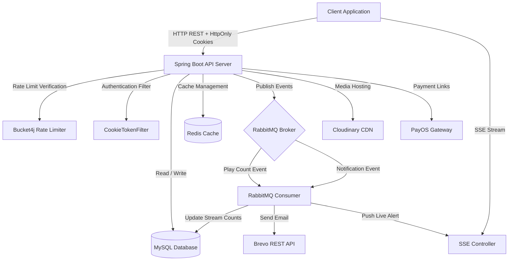

# Spotify Clone Backend

A high-performance RESTful API backend for a Spotify clone application built with **Java 21** and **Spring Boot 3.4.6**. The system delivers scalable music streaming, robust authentication with HttpOnly cookie handling, IP-based rate limiting, real-time Server-Sent Events (SSE), event-driven background processing, and distributed caching.

---

## System Architecture

The backend follows an event-driven architecture designed to decouple heavy workloads from synchronous HTTP worker threads while guaranteeing high security and fast responses.



---

## Core Features

### 1. Identity, Security & HttpOnly Cookie Authentication
- **HttpOnly Cookie Session Management**: Issues JWT access tokens encapsulated within `HttpOnly`, `Secure`, `SameSite=None` cookies (`access_token`). This completely isolates tokens from browser JavaScript context, mitigating Cross-Site Scripting (XSS) risks.
- **Transparent Filter Pipeline (`CookieTokenFilter`)**: Intercepts incoming requests, extracts the JWT from `access_token` cookies, and wraps the request header with `Authorization: Bearer <token>`. This reuses Spring Security's native OAuth2 Resource Server validation pipeline.
- **Public Endpoint Bypass**: Automatically skips cookie injection on public routes (such as public song/album endpoints and auth endpoints). This prevents expired cookies from triggering false `401 Unauthorized` responses on public resources.
- **Token Invalidation & Cookie Revocation**: Supports explicit token blacklisting on logout while simultaneously clearing client-side cookies using `Max-Age=0` HTTP headers.
- **Social Login & Protection**: Google OAuth2 authentication flow with automatic cookie issuance, complemented by Google reCAPTCHA v3 verification during account registration.
- **Role-Based Access Control (RBAC)**: Fine-grained permissions enforced across `Guest`, `User`, `Artist`, and `Admin` roles.

### 2. Rate Limiting & Threat Protection
- **Token Bucket Algorithm (Bucket4j)**: Integrated `RateLimitService` enforces rate limits using in-memory token buckets (`bucket4j-core`).
- **Endpoint Protection**: Guards sensitive endpoints (such as `/auth/token`) against brute-force attacks and credential stuffing by capping requests at 10 requests per minute per IP address.
- **Reverse Proxy IP Resolution**: Resolves client IP addresses across proxies using `X-Forwarded-For` header analysis.
- **Automated Bucket Eviction**: Scheduled background tasks (`@Scheduled`) periodically prune inactive IP buckets every 10 minutes to eliminate memory leak vectors.
- **Standardized Rate Limit Exceptions**: Exceeding rate quotas immediately returns HTTP 429 (`TOO_MANY_REQUESTS`).

### 3. Music Catalog & Social Media
- **Catalog Management**: CRUD operations for Songs, Albums, Artists, Playlists, Categories, and Sync Lyrics.
- **Search Capabilities**: Global multi-entity search and scoped intra-playlist filtering.
- **Social Interactions**: User like/unlike tracking, user/artist following, public/private profile controls, and user blocklist management.
- **Cloud Media Delivery**: Audio files and cover images stored and served via Cloudinary CDN.

### 4. Event-Driven Messaging (RabbitMQ)
Asynchronous task delegation powered by RabbitMQ (`spring-boot-starter-amqp`) decouples computational tasks from synchronous request cycles:
- **Play Count Aggregation**: Asynchronous processing via `play_count_queue` to prevent database locks under high concurrent streams.
- **Notification Queue**: Routing system events to `notification_queue` for processing.
- **Real-Time SSE Routing**: Instant user events pushed through `sse_queue` directly to target client streams.

### 5. Advanced Caching (Redis)
Custom Redis configuration engineered for high performance:
- **Targeted TTL Policies**: 10-minute TTL for administrative dashboard summaries; 5-minute TTL for artist profiles, album views, and public catalog listings.
- **Polymorphic Deserialization**: Configured Jackson `ObjectMapper` with polymorphic typing (`DefaultTyping.NON_FINAL`) to handle generic paginated responses and complex JPA entities without type erasure errors.

### 6. Server-Sent Events (SSE)
Real-time push notifications delivered over HTTP via `SseEmitter`. Authenticated subscribers connect to `/sse/subscribe` to receive real-time alerts without short or long polling overhead.

### 7. Subscriptions & Payment Integration
PayOS payment gateway integration for managing Premium subscription plans:
- Secure payment link generation and signature verification for webhooks.
- Automated daily background scheduler (`PremiumScheduler`) to revoke expired subscription privileges.

### 8. Transactional Email Services
Integration with Brevo (formerly Sendinblue) Transactional REST API for OTP verification and password reset emails, bypassing outbound SMTP port blocking restrictions in cloud environments.

---

## Tech Stack

| Domain | Technology |
| :--- | :--- |
| **Language & Framework** | Java 21, Spring Boot 3.4.6 |
| **Security & Auth** | Spring Security, OAuth2 Resource Server, JWT, HttpOnly Cookies, Google reCAPTCHA v3 |
| **Rate Limiting** | Bucket4j 8.10.1 |
| **Database & Persistence** | MySQL 8.x, Hibernate, Spring Data JPA |
| **Caching** | Redis (Lettuce Client, Jackson Polymorphic Typing) |
| **Message Broker** | RabbitMQ (Spring AMQP) |
| **Storage & CDN** | Cloudinary |
| **Payment Gateway** | PayOS SDK |
| **Email Service** | Brevo Transactional REST API |
| **Object Mapping** | MapStruct 1.5.5 |

---

## Project Structure

```text
src/main/java/com/spotify/spotify
├── configuration   # Security, CookieTokenFilter, Cache, RabbitMQ, Cloudinary, RestTemplate
├── controller      # REST API Controllers (Auth, Music, Playlists, SSE, Payment, etc.)
├── dto             # Data Transfer Objects & Event Payload Schemas
├── entity          # JPA Entities (User, Role, Song, Album, Playlist, Like, Stream, Notification)
├── exception       # Global Exception Handling (@ControllerAdvice, ErrorCodes)
├── kafka           # [Legacy] Deactivated Kafka configuration
├── mapper          # MapStruct Converters (UserMapper, SongMapper, AlbumMapper)
├── rabbitmq        # Active RabbitMQ Event Consumers and Handlers
├── repository      # Spring Data JPA Repositories
└── service         # Core Business Services (Auth, RateLimit, Email, Music, Payment, SSE)
```

---

## Getting Started

### Prerequisites
- **Java 21** or higher
- **Maven 3.8+**
- **Docker & Docker Compose**

### Step 1: Launch Infrastructure Services
Start the required local services (MySQL, Redis, RabbitMQ) using Docker Compose:
```bash
docker-compose up -d
```
Service ports:
- **MySQL**: `3306` (Database: `spotify`)
- **Redis**: `6379`
- **RabbitMQ**: `5672` (AMQP Broker), `15672` (Management Dashboard)

### Step 2: Environment Configuration
Create a `.env` file in the project root directory (alongside `pom.xml`):
```env
# Database Configuration
DB_NAME=spotify
DB_USERNAME=root
DB_PASSWORD=root

# RabbitMQ Credentials
RABBITMQ_USERNAME=guest
RABBITMQ_PASSWORD=guest

# Brevo HTTP Email Service
BREVO_API_KEY=your_brevo_api_key
MAIL_FROM=your_sender_email@domain.com

# Cloudinary Storage
KEY_CLOUD=your_cloudinary_api_key
SECRET_CLOUD=your_cloudinary_api_secret

# PayOS Payment Gateway
PAYOS_CLIENT_ID=your_payos_client_id
PAYOS_API_KEY=your_payos_api_key
PAYOS_CHECKSUM_KEY=your_payos_checksum_key

# Google OAuth2 & reCAPTCHA v3
GOOGLE_OAUTH_CLIENT_ID=your_google_client_id
GOOGLE_OAUTH_CLIENT_SECRET=your_google_client_secret
RECAPTCHA_SECRET_KEY=your_recaptcha_secret_key
FRONTEND_PROD_URL=http://localhost:5173/oauth2/callback
```

### Step 3: Build and Run
Compile and run the Spring Boot application using Maven Wrapper:
```bash
# Package application
./mvnw clean package -DskipTests

# Start server
./mvnw spring-boot:run
```
The server will run at: `http://localhost:8080/spotify`.

---

## Production Deployment

For production environments, activate the `prod` profile by setting the environment variable `SPRING_PROFILES_ACTIVE=prod`. This activates `application-prod.yaml` configured for:
- Managed MySQL (e.g., Aiven)
- Managed Redis with TLS/SSL (e.g., Upstash)
- Cloud RabbitMQ (e.g., CloudAMQP)

