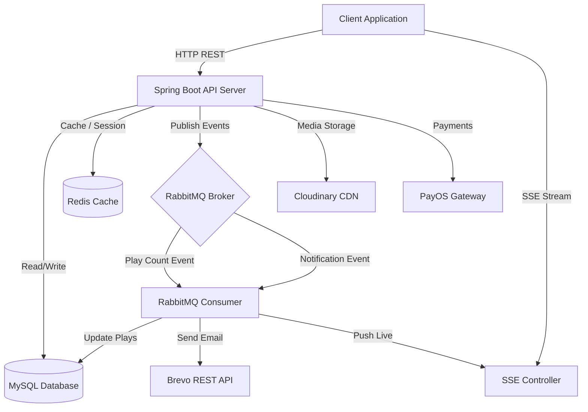

# Spotify Clone Backend 🎵

A comprehensive, high-performance backend for a Spotify clone application built with **Java 21** and **Spring Boot 3.4.6**. It provides a robust RESTful API for music streaming, user management, playlist creation, real-time notifications, caching, and social features.

---

## 📖 System Architecture

The backend is built using a modern event-driven microservices-friendly architecture, leveraging several high-performance services to ensure high availability and responsiveness.



---

## ✨ Features

### 1. Identity & Security
- **Secure Authentication**: JWT-based stateless authentication with support for refresh tokens and token blacklisting/invalidation.
- **Social Login**: Integrated Google OAuth2 flow returning direct secure JWTs.
- **Bot Protection**: Google reCAPTCHA v3 validation on user signup.
- **Role-Based Access Control**: Strict access levels for `Guest`, `User`, `Artist`, and `Admin`.

### 2. Music Catalog & Social Media
- **Core Catalog**: Complete CRUD management for Songs, Albums, Artists, Playlists, Categories, and Lyrics.
- **Social Interaction**: Like/unlike songs, follow/unfollow artists and users, customize public/private profiles, and manage user blocklists.
- **Cloud Media**: Direct streaming and upload of audio files and images hosted on **Cloudinary CDN**.

### 3. Event-Driven System (RabbitMQ)
The system uses **RabbitMQ** (via `spring-boot-starter-amqp`) as its message broker to process resource-intensive tasks asynchronously, decoupled from the HTTP thread pool:
- **Play Count Tracking**: Plays are published to `play_count_queue` and batched to prevent database locks.
- **Notification Routing**: System events trigger notifications pushed to `notification_queue`.
- **SSE Routing**: Live events (like messages or follows) go to `sse_queue` to be pushed directly to users.
> [!NOTE]
> *Legacy code for Apache Kafka exists within the project (`com.spotify.spotify.kafka`), but has been deactivated in favor of RabbitMQ for simplified and more reliable messaging.*

### 4. Advanced Caching (Redis)
A custom **Redis Cache Manager** is implemented with specific TTL (Time-To-Live) configs:
- **Specific Cache Rules**: 10-minute TTL for admin dashboards and 5-minute TTL for artist profiles, album views, and page listings.
- **Jackson Polymorphic Serialization**: Custom `ObjectMapper` configuration utilizing polymorphic typing (`ObjectMapper.DefaultTyping.NON_FINAL`) to support correct deserialization of complex objects (such as paginated items and custom entities) from cache without casting exceptions.

### 5. Server-Sent Events (SSE)
Real-time notification delivery is powered by **SSE (Server-Sent Events)** through `SseEmitter`. Clients subscribe to `/sse/subscribe` using their JWT, allowing the backend to stream notifications and system updates directly without polling.

### 6. Subscriptions & Payments
Integrated with the **PayOS Payment Gateway** for Premium upgrades:
- Handles pay links creation and secure webhook validation.
- An automated cron scheduler (`PremiumScheduler`) runs daily to automatically deactivate expired Premium accounts.

### 7. Email Notifications
Uses **Brevo (formerly Sendinblue) Transactional Emails API** via HTTP POST. 
> [!IMPORTANT]
> *Traditional JavaMail SMTP is replaced by Brevo's REST API endpoint (`https://api.brevo.com/v3/smtp/email`) to bypass network SMTP port blocking issues common in cloud environments (like Railway).*

---

## 🛠️ Tech Stack

- **Language**: Java 21
- **Framework**: Spring Boot 3.4.6
- **Database**: MySQL 8.x, Hibernate / JPA
- **Caching**: Redis (Lettuce client)
- **Message Broker**: RabbitMQ
- **Media Provider**: Cloudinary
- **DTO Mapping**: MapStruct 1.5.5
- **Payment Gateway**: PayOS
- **Security**: Spring Security, OAuth2 Resource Server, JWT

---

## 📁 Project Structure

```text
src/main/java/com/spotify/spotify
├── configuration   # Security, Cache, RabbitMQ, Cloudinary, RestTemplate, Lyrics converters
├── controller      # RESTful API Endpoints (Auth, Music, Playlists, SSE, Orders, etc.)
├── dto             # Request/Response DTOs & Event schemas
├── entity          # JPA Entities (User, Role, Song, Album, Playlist, Like, Stream, Notification)
├── exception       # Global Exception Handler (@ControllerAdvice) and ErrorCodes
├── kafka           # [Legacy] Deactivated Kafka Producers and Consumers
├── mapper          # MapStruct Mapper Interfaces (UserMapper, SongMapper, etc.)
├── rabbitmq        # Active RabbitMQ Consumers and message processing handlers
├── repository      # Spring Data JPA Repositories (with custom query hooks)
└── service         # Core Business Logic (Auth, Email, Music, Payment, SSE, etc.)
```

---

## 🚀 Getting Started

### Prerequisites
Make sure you have the following installed on your machine:
- **Java 21** or higher
- **Maven 3.8+**
- **Docker & Docker Compose** (Highly recommended for database/cache infrastructure)

### Step 1: Run Infrastructure using Docker Compose
The easiest way to run the database, cache, and message broker locally is using the provided `docker-compose.yml`:
```bash
docker-compose up -d
```
This spins up:
- **MySQL** on port `3306` (creates a database named `spotify`)
- **Redis** on port `6379`
- **RabbitMQ** on port `5672` (main queue) and port `15672` (Management Dashboard)

### Step 2: Configure Environment Variables
Create a `.env` file in the `spotify` root directory (same folder as `pom.xml`) and specify the following keys:
```env
# Database Credentials
DB_NAME=spotify
DB_USERNAME=root
DB_PASSWORD=root

# RabbitMQ Credentials
RABBITMQ_USERNAME=guest
RABBITMQ_PASSWORD=guest

# Brevo HTTP Email Service
BREVO_API_KEY=your_brevo_api_key
MAIL_FROM=your_sender_email@domain.com

# Cloudinary
KEY_CLOUD=your_cloudinary_api_key
SECRET_CLOUD=your_cloudinary_api_secret

# PayOS (Subscription Payment)
PAYOS_CLIENT_ID=your_payos_client_id
PAYOS_API_KEY=your_payos_api_key
PAYOS_CHECKSUM_KEY=your_payos_checksum_key

# Google OAuth2 & reCAPTCHA v3
GOOGLE_OAUTH_CLIENT_ID=your_google_client_id
GOOGLE_OAUTH_CLIENT_SECRET=your_google_client_secret
RECAPTCHA_SECRET_KEY=your_recaptcha_secret_key
FRONTEND_PROD_URL=http://localhost:5173/oauth2/callback
```

### Step 3: Run the Application
Clean, package, and start the application using the Maven wrapper:
```bash
# Compile and package jar
./mvnw clean package -DskipTests

# Start Spring Boot
./mvnw spring-boot:run
```
The application will run at: `http://localhost:8080/spotify`.

---

## ⚙️ Production Configurations
For production environments, the system runs with the `prod` profile, activating `application-prod.yaml`. 
Ensure you define `SPRING_PROFILES_ACTIVE=prod` in your environment. This will connect to:
- Aiven Cloud MySQL
- Upstash Redis (with SSL/TLS enabled)
- CloudAMQP RabbitMQ
